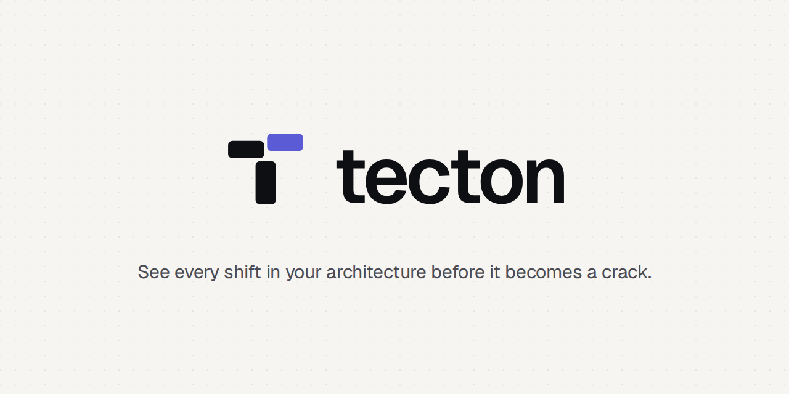

<p align="center"></p>

# Tecton

**See every shift in your architecture before it becomes a crack.**

Tecton draws your project as a map of **modules** (folders) and the **dependencies** between them,
compares it with a git branch, and checks **house rules** such as "components must not talk to the
database directly". You get an interactive HTML page, an optional Markdown summary for pull requests,
and a non-zero exit code when a change breaks a rule.

- No dependencies. Needs Node 18+ and git.
- Understands `import`, `export … from`, `require()`, `import()`, `tsconfig`/`jsconfig` path aliases
  (like `@/components/...`), `index` files and `./file.js` → `file.ts`.
- Compares against the point where your branch split off, so work merged to `main` meanwhile
  doesn't show up as your change.

## Quick start

```bash
cd your-project
node /path/to/tecton/bin/tecton.js init     # writes tecton.config.json with your modules
node /path/to/tecton/bin/tecton.js --open   # compares your working copy with main
```

Or link it once so the `tecton` command works everywhere: `cd tecton && npm link`.

## The report

One self-contained HTML file (fonts included, works offline) laid out like a small SaaS app:

- **Overview**: pass/fail status, counters, a breakdown of dependency changes, rule checks, a live map preview and files per module.
- **Architecture**: a system diagram read from your code. It shows each app (every `package.json`: Next.js, Express, …), its pages, API routes, HTTP endpoints and npm-script jobs.
  It also shows the data stores the code uses (SQLite, Postgres, Mongo, Redis, Prisma, …) and the outside services it calls (hosts in URLs, plus SDKs like Stripe, OpenAI and nodemailer).
  Arrows connect them, including app-to-app calls found through env vars like `BACKEND_URL`. New or removed pieces are highlighted. Hover a service to see who uses it, or click anything to see the exact lines.
- **Dependency map**: switch between **Changes / Before / After**. Boxes never move between views, so you can flip back and forth.
  Green = new dependency, red dashed = removed, orange = breaks a rule. Numbers on arrows are how many imports.
  Hover for details. Click a box or arrow to open a side panel with the files and the exact `file:line` imports behind it.
  Also includes a minimap, zoom (scroll or pinch), **Only changes** mode and SVG export.
- **Rule checks**: every rule with its status. Expand one to see each break and where it happens.
- **Changes** and **Modules**: tables you can filter, search and sort. Clicking a row jumps to it on the map.
- **⌘K / Ctrl K** (or `/`): a command palette to jump to any module, dependency, rule or action.
  Keys `1`–`6` switch pages, `F` fits the map, `Esc` closes things.
- Light, dark and system themes. **Copy PR summary** puts the Markdown summary on your clipboard.

The Geist fonts are embedded under the SIL Open Font License (`src/report/fonts/OFL-LICENSE.txt`).

## Config (`tecton.config.json`)

Projects set up with the old name keep working: `archdiff.config.json` is read if there's no `tecton.config.json`.

```jsonc
{
  "root": "src",          // folder to analyse (default: "src" if it exists, else the project folder)
  "depth": 1,             // 1 = src/components, src/lib...; 2 = src/features/cart, src/features/auth...
  "cycles": "warn",       // flag modules that depend on each other in a loop: "warn" | "error" | "off"
  "rules": [
    // forbidden: "from" may not use anything in "to"
    { "name": "UI must not touch the database", "from": "components", "to": ["db", "npm:pg"],
      "message": "Call a service instead." },
    // allow-list: "from" may only use these internal modules
    { "name": "lib stays dependency-free", "from": "lib", "allow": [] },
    // wildcards work, and "severity": "warn" reports without failing CI
    { "name": "features stay independent", "from": "features/*", "to": ["features/*"], "severity": "warn" }
  ],

  // optional
  "modules": { "ui": ["src/components", "src/app/**/_components/**"] }, // group folders by hand (first match wins)
  "exclude": ["src/generated/**"],     // tests, stories and *.config.* files are skipped already
  "aliases": { "~/": "src/" },         // extra import aliases beyond tsconfig "paths"
  "externals": false,                  // true = draw every npm package; otherwise only ones named in rules
  "base": "develop"                    // default branch to compare with
}
```

Module names are folder paths under `root` (`components`, `features/cart`). npm packages are `npm:<name>`.
A module can import itself freely; rules are about arrows between modules.

## Command line

```
tecton [dir] [--base <ref>] [--head <ref>] [--out report.html] [--md summary.md] [--json data.json]
               [--config file] [--no-merge-base] [--strict] [--open]
tecton init [dir]
```

Exit code: `1` if the change adds a rule break with severity `error` (`--strict`: any rule break), `2` for usage errors.
Without git (or without a base branch) it shows a snapshot and fails on any rule break.

## In CI

`examples/github-workflow.yml` runs tecton on every pull request, posts the Markdown summary
(with a Mermaid diagram of only the parts that changed) as a PR comment, uploads the HTML report,
and fails the check if a rule is broken.

## Brand

The logo files are in [`brand/`](brand/): the mark, lockups for light and dark, app icons, a favicon and a social banner. See `CLAUDE.md` for how to use them.

## Limits (v0.3)

- JS/TS only. Vue/Svelte single-file components aren't read yet.
- Imports are found with a careful text scan, not a full parser, so exotic code can occasionally be missed.
- The architecture view is heuristic. It finds services from URLs, known SDKs and `*_URL`-style env vars. Queues, shared tables and URLs built at runtime from config aren't detected.
- Express route prefixes set with `app.use('/api', router)` aren't added to the endpoint paths.
